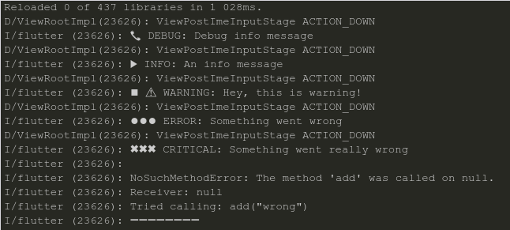
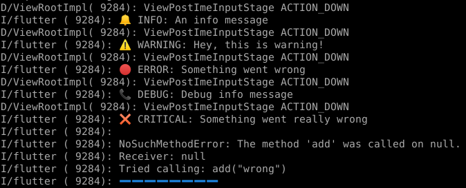

# Err

[](https://pub.dartlang.org/packages/err) [](https://pub.dartlang.org/documentation/err/latest/err/err-library.html)

A logs router. The messages can be routed to:

- Terminal
- Flash messages
- Snackbar messages
- Notifications

## Configuration

Configure the log levels's routes: available routes: console, screen, notifications or black hole. All the logs routed to the black hole will be silently swallowed: use it this to disable a route. 

All routes default to console.

   ```dart
   import 'package:err/err.dart';

   var logger = ErrRouter(
      criticalRoute: [ErrRoute.console, ErrRoute.screen],
      errorRoute: [ErrRoute.screen, ErrRoute.console],
      warningRoute: [ErrRoute.screen, ErrRoute.console, ErrRoute.notification],
      infoRoute: [ErrRoute.screen],
      debugRoute: [ErrRoute.blackHole]);
   ```

## Screen route

### Flash messages

The flash messages are toast messages. They stay one second on the screen

   ```dart
   @override
   void initState() {
      logger.debugFlash("Init state");
       super.initState();
   }
   ```

Available flash messages:

**`debugFlash`**(`String` *msg*): a debug message

**`infoFlash`**(`String` *msg*): an information message

**`flash`**(`String` *msg*): alias for `debugFlash`


### Snackbar messages

The snackbar messages need a `BuildContext`

   ```dart
   logger.info("File uploaded in $elapsed s", context);
   logger.debug("A debug message", context);
   try {
      somethingWrong();
   } catch(ex) {
      logger.criticalErrSync(
         err: ex,
         msg: "Something wrong happened",
         context: context);  
   }
   ```

Available messages

**`critical`**(`String` *msg*): will stay on screen until dismissed

**`criticalErr`**({`String` *msg*, `dynamic` *err*}): `err` is an error or an exception. Will stay on screen until dismissed

**`error`**(`String` *msg*): will stay on screen until dismissed

**`errorErr`**({`String` *msg*, `dynamic` *err*}): `err` is an error or an exception. Will stay on screen until dismissed

**`warning`**(`String` *msg*): will stay on screen until dismissed

**`warningErr`**({`String` *msg*, `dynamic` *err*}): `err` is an error or an exception. Will stay on screen until dismissed

**`warningShort`**(`String` *msg*): will stay on screen for 3 seconds

**`warningErrShort`**({`String` *msg*, `dynamic` *err*}): `err` is an error or an exception. Will stay on screen for 3 seconds

**`info`**(`String` *msg*): will stay on screen for 3 seconds

**`debug`**(`String` *msg*): will stay on screen for 3 seconds

All the functions are async. To use them in a synchronous maner append
`Sync` to their name. Ex: `errorSync()`.


## Notifications route

The messages will pop as notifications. A special method is available for notifications:

**`notify`**({`String` *msg*, `ErrType` *errType*}): will popup a notification of the specified error type

## Console route



By default the terminal output is configured for black and white. If your terminal supports colorized unicode emoticons use this parameter:

   ```dart
   var logger = ErrRouter(
      // ...
      terminalColors: true);
   ```



## Libraries used

- [Flutter toast](https://pub.dartlang.org/packages/fluttertoast)
- [Flushbar](https://pub.dartlang.org/packages/flushbar)
- [Flutter Local Notifications](https://github.com/MaikuB/flutter_local_notifications)
